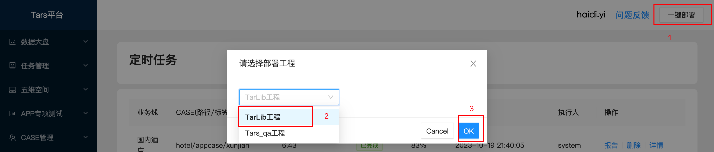

### 在1台主服务器和3台从服务器上分别拉取master代码(Tars平台一键部署功能)
一键部署后，各服务器就会自动拉取master分支代码 
### 本地连接远程主服务器
#### 桌面 -> 前往 -> 连接服务器

#### 输入`vnc://`加上服务器`ip`
服务器ip分别为：

| ip | 用户名 | 服务类型 |
| --- | --- | --- |
| 100.80.192.124 | 905 | 主服务 |
| 100.80.193.75 | QITNAC000392 | 从服务 |
| 100.80.193.63 | qitmac000979 | 从服务 |
| 100.80.193.86 | QITMAC000978 | 从服务 |

#### 输入用户名（见上表）和密码（tzmm.987）
密码：tzmm.987 
### 在主服务器中重启服务
终端执行：`cd Desktop/Tars/TarsLib/script/ansible`进入重启服务脚本的文件夹 执行：`ansible-playbook restartServer.yml`重启服务

