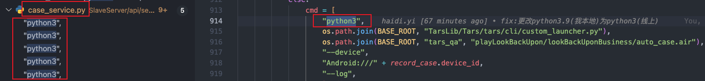

想要改动case报告的话，需要在每次改动`Airtest/airtest/report/log_template_new.html`文件后，重新跑一个case，重新生成一个报告，才能看到改动的效果。<br />所以可以在本地启动从服务：`slave_server.py`，通过postman直接请求从服务运行case的接口`run_case`（前提是要有手机通过数据线连接到自己电脑上）
### 本地启动从服务，获得服务启动地址
在launch.json文件中配置好从服务(slave_server.py)的启动地址：
```json
{
    // Use IntelliSense to learn about possible attributes.
    // Hover to view descriptions of existing attributes.
    // For more information, visit: https://go.microsoft.com/fwlink/?linkid=830387
    "version": "0.2.0",
    "configurations": [
        {
            "name": "Python: 当前文件",
            "type": "python",
            "request": "launch",
            "program": "/Users/qitmac001378/Desktop/Tars/TarsLib/MasterServer/master_server.py",
            "console": "integratedTerminal"
        },
        {
            "name": "Python: Master",
            "type": "python",
            "request": "launch",
            "program": "/Users/qitmac001378/Desktop/Tars/TarsLib/MasterServer/master_server.py",
            "console": "integratedTerminal",
            "args": [
                "test" // 可选择启动方式：[prod / test / local]
            ]
        },
        {
            "name": "Python: Slaver",
            "type": "python",
            "request": "launch",
            "program": "/Users/qitmac001378/Desktop/Tars/TarsLib/SlaveServer/slave_server.py",
            "console": "integratedTerminal",
            "justMyCode": true,
            "args": [
                "prod"
            ]
        }
    ]
}
```
在vscode中启动从服务：<br />
#### 这里启动从服务时可能会有本地环境问题报错
根本原因还是我电脑中有多个版本的python3，`case_service`中指定的python3有可能找的不是`python3.9`，所以需要把下图中的`python3`改为`python3.9`，从而明确指定python3版本。<br />注：**记得上线前把python3.9再改回python3**<br />
### 构造run_case接口的入参
#### 在代码中找到run_case接口，构造接口地址：`[http://100.80.192.42:8082](http://100.80.192.42:8082) /caseservice/run_case/`
#### 代码中可以找到需要的入参：
```json
{
    "task_id": "b3f351f2-6e65-11ee-9ef1-f01898ed9c46",
    "dispatch_id": "653478",
    "device_id": "ALWQVB1610028916",
    "platform": "Android"
}
```
其中`device_id`是在手机连接到电脑上后，通过`adv devices`命令得到的：
```json
qitmac001378@QITMAC001378deMacBook-Pro Tars % adb devices
List of devices attached
ALWQVB1610028916	device
```
`task_id`和`dispatch_id`是在tars平台上取得的（我们本地去跑，实际上是重新跑一个线上跑过的case(才会有task_id和dispatch_id)，因为我们只是想验证生成的case报告是否正确）<br />在tars平台随便点进一个任务，可以看到task_id和dispatch_id<br />
### 注释删除本地log的代码：`SlaveServer/api/service/case_service.py:793`
有需求要把log文件存放到云端，所以龙辉写了代码把每次产生的log文件从本地删除，想要在本地看到生成的log文件(case执行时的截图，和case报告等)，需要注释一行代码：`shutil.rmtree(log_dir)`
```python
if logPath != None:
    # 最后将log.html中的jpg文件等url修改后上传
    for index in range(len(imgList)):
        fileUtils.alter(logPath, imgList[index]['nowImgPath'], imgList[index]['ossImgPath'])
    # 将该链接替换report_url
    logUrl = oss_client.upload_file(filename = logPath, key = logKey)
    CaseUtil.update_report_url(case_poll_model=case_params, report_url=logUrl)
    # 把目录删除
# shutil.rmtree(log_dir)      # 删除本地报告
```
