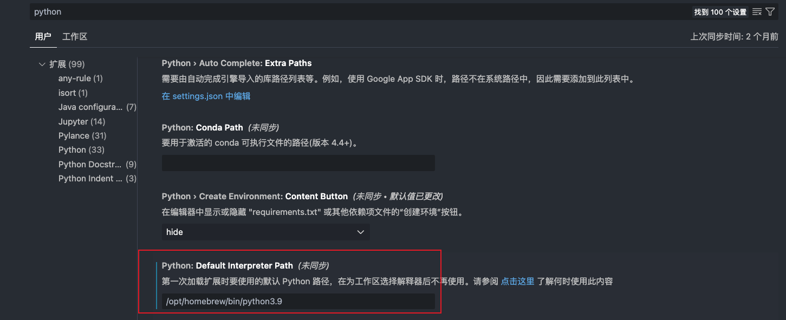
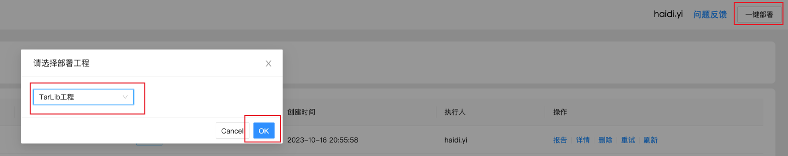

> wiki:
> [https://wiki.corp.qunar.com/confluence/pages/viewpage.action?pageId=524620407](https://wiki.corp.qunar.com/confluence/pages/viewpage.action?pageId=524620407)
> [https://wiki.corp.qunar.com/confluence/pages/viewpage.action?pageId=520521042](https://wiki.corp.qunar.com/confluence/pages/viewpage.action?pageId=520521042)

### 安装依赖：python版本需求：3.9
> 安装依赖的命令：sudo python3.9 -m pip install -r requirements.txt -i https://pypi.tuna.tsinghua.edu.cn/simple

自己的python版本本来是3.11，安装依赖时安装`Pillow~=8.3.2`失败，但是不指定`Pillow`版本(默认安装10.x版本)可以安装成功。在此过程中尝试了卸载和安装其他版本的python，学习了homebrew工具的使用，**通过brew install和brew uninstall可以很方便的管理mac中的第三方工具。**<br />使用python3.11启动服务(master_server.py文件)时，启动失败，报错：`'not' is not a valid parameter name`，此问题最终没能解决，询问宇哥，果断更换为python3.9版本，与其开发时用的python版本保持一致。
> 下次再跑项目的时候，要提前看看项目的环境要求，尽量和项目开始时保持一致，减少配环境过程中花费的时间。

### 安装tkinter库：brew install python-tk@3.9
通过步骤1将python版本更换为python3.9并根据提示安装`tkinter`库后，运行`master_server.py`文件启动服务时仍然报错：RuntimeError: Directory 'archive' does not exist。这个报错其实可以读懂，原因是找不到archive文件，也定位到了报错的文件位置：route.py最后一行：`app.mount(path='/static', app=StaticFiles(directory="archive"), name='static')`。但是还是没能自己独立解决，主要是不确定这行代码的作用。询问纯志哥后把这行代码注释掉了，问题解决。
### 解决运行`master_server.py`文件启动服务时报错的问题
这个报错主要包含两个方面的问题：<br />第一是电脑中默认的python环境是python3.11，虽然我在运行master_server.py文件时指定了以python3.9运行，但是在调用site-packages里的第三方库时，调的仍然是python3.11的。**解决方式是在vscode设置中修改默认使用的python版本为python3.9（通过 **`**which python3.9**`**命令可以看到python3.9的路径）**。(此时通过vscode运行按钮执行python程序使用的就是python3.9了，但是在命令行中运行python程序时，默认仍然是python3.11)<br /><br />第二是我运行master_server.py程序时是在MasterServer路径下执行的python命令，而报错的代码：`app.mount(path='/static', app=StaticFiles(directory="archive"), name='static')`，是在当前文件路径中寻找archive文件夹的，archive文件夹是建在MasterServer文件夹的父路径的，所以一直报错找不到archive文件夹。在MasterServer文件夹的父路径TarsLib路径下执行：`python3.9 MasterServer/master_server.py`启动服务，问题解决。
### 编写服务启动脚本：启动master_server.py文件
在TarsLib工程根目录下创建.vscode文件夹，在.vscode文件夹中创建launch.json文件，写入如下代码：
```python
{
    // Use IntelliSense to learn about possible attributes.
    // Hover to view descriptions of existing attributes.
    // For more information, visit: https://go.microsoft.com/fwlink/?linkid=830387
    "version": "0.2.0",
    "configurations": [
        {
            "name": "Python: 当前文件",
            "type": "python",
            "request": "launch",
            "program": "/Users/qitmac001378/Desktop/TarsLib/MasterServer/master_server.py",
            "console": "integratedTerminal"
        },
        {
            "name": "Python: Master",
            "type": "python",
            "request": "launch",
            "program": "/Users/qitmac001378/Desktop/TarsLib/MasterServer/master_server.py",
            "console": "integratedTerminal",
            "args": [
                "test" // 可选择启动方式：[prod / test / local]
            ]
        },
        {
            "name": "Python: Slaver",
            "type": "python",
            "request": "launch",
            "program": "/Users/qitmac001378/Desktop/TarsLib/MasterServer/master_server.py",
            "console": "integratedTerminal",
            "args": [
                "test"
            ]
        }
    ]
}
```
> 脚本中program字段指定了master_server.py文件的绝对路径，宇哥他们基本都是用这个脚本启动服务，所以没有遇到我在命令行启动时的找不到archive文件夹的问题。

> 注："args": ["test"]  // 可选择启动方式：[prod / test / local]，改变args的值后，接口的url会改变，需要在前端项目`tars-management-system`中做相应修改：src -> service -> utils -> fetchHelper.js文件中修改`commonUrl`变量的值。
> 

### 本地开发时最好关闭设备轮询
`master_server.py`文件最后一部分，第255行注释掉。
```python
# 线上环境，只允许124主机调度
if 'a905' in __file__:
    # 开启设备轮询
    # threading.Thread(target=device_poll_start).start()	// 本地开发时注释掉这一行
    # 执行服务启动后的初始化动作
    threading.Thread(target=actions_after_server_started).start()
    # 执行服务启动:初始化主流程回溯动作
    threading.Thread(target=actions_after_interaction_server_started).start()
    # 执行服务启动:初始化保险回溯动作
    run_env = os.getenv('run_env')
    if run_env == 'prod':
        # 生产环境拉取保险回溯
        threading.Thread(target=actions_after_insure_server_started).start()
    # 开启定时任务 获取T-1天的项目发布历史
    scheduler.start()

uvicorn.run(app=app,
            host=HOST_IP,
            port=MASTER_PORT,
            workers=1)
```

### 重启服务
#### a. 将本地写好的代码和入master分支
#### b. 在Tars界面一键部署（相当于拉取master分支代码到各个服务器）

#### c. 登录主服务器，重启服务
> 重启服务前，需要在Tars平台 -> 任务管理 -> 手动任务、项目任务、定时任务中**确定没有正在执行的任务**。

执行：`cd Desktop/Tars/TarsLib/script/ansible`进入文件夹<br />执行：`ansible-playbook restartServer.yml`重启服务

### 查看日志和程序中的print()输出
> tail -f 日志文件

#### 查看主服务器日志：
在主服务器终端执行：`tail -f /Users/a905/Desktop/Tars/TarsLib/archive/master_server.log`
#### 查看从服务器日志：
在从服务器终端执行：`tail -f /Users/qitnac000392/Desktop/Tars/TarsLib/archive/slave_server.log`<br />**注：从服务器有3台，所以在不同从服务器中查看日志，需要修改**`qitnac000392`**部分为对应的电脑用户名。**<br />**推荐在命令行中输入：tail -f后，找到slave_server.log文件，拖到命令行中，即可自动得到此文件路径。**
