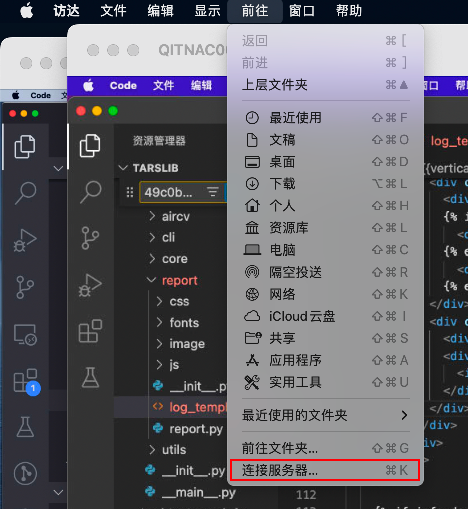
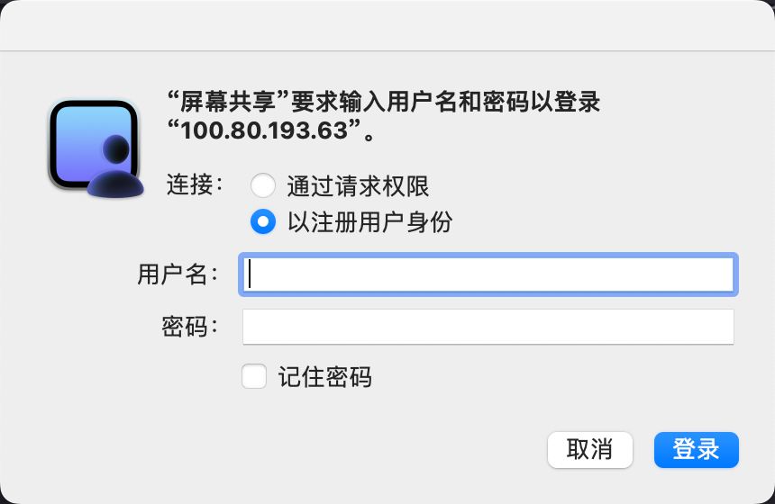

### 自己电脑连接Tars服务器（Tars服务器其实就是一个电脑，在那个电脑上一直启动着TarsLib工程的服务）
#### 桌面 -> 前往 -> 连接服务器

#### 输入`vnc://`加上服务器`ip`
服务器ip分别为：

| ip | 用户名 | 服务类型 |
| --- | --- | --- |
| 100.80.192.124 | 905 | 主服务 |
| 100.80.193.75 | QITNAC000392 | 从服务 |
| 100.80.193.63 | qitmac000979 | 从服务 |
| 100.80.193.86 | QITMAC000978 | 从服务 |

#### 输入用户名（间上表）和密码（tzmm.987）
密码：tzmm.987 

