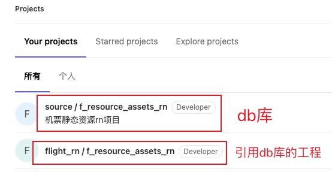
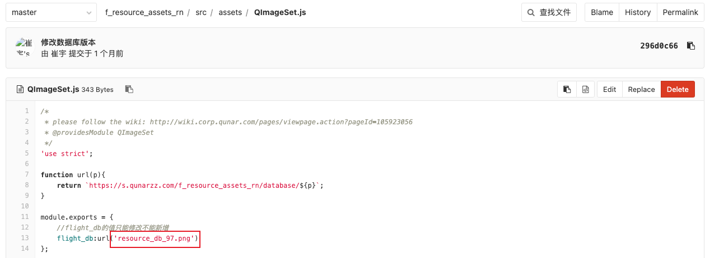
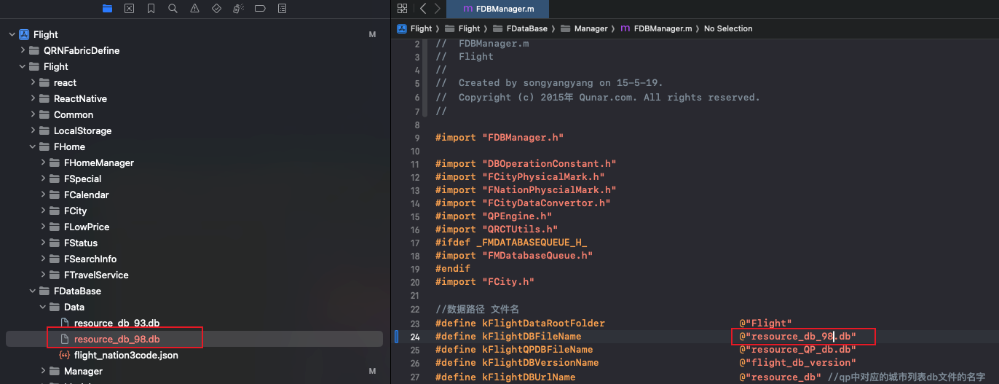

> 参考：[https://wiki.corp.qunar.com/pages/viewpage.action?pageId=405382074](https://wiki.corp.qunar.com/pages/viewpage.action?pageId=405382074)

### 修改source / f_resource_assets_rn工程
`source / f_resource_assets_rn`工程是存储数据库的静态资源，每次修改城市列表时，需要添加一个新的数据库（复制旧的，在旧的基础上改），推送到gitlab后不能修改数据库文件，要对城市列表做修改，需要再添加一个新的数据库。 数据库的后缀原本应该是`.db`，为了符合`QImageSet`的打包逻辑，将后缀改为`.png`。 
### 修改flight_rn / f_resource_assets_rn工程
`flight_rn / f_resource_assets_rn`工程是引用db库的工程，`source / f_resource_assets_rn`中修改完db库后需要在此处更改db库的版本号。 
### 验证
在`iphone_ive_flight`工程中的FDataBase -> Data中将数据库文件添加进来，并修改`FDBManager.m`文件中的数据库文件名。然后启动app验证即可。 
