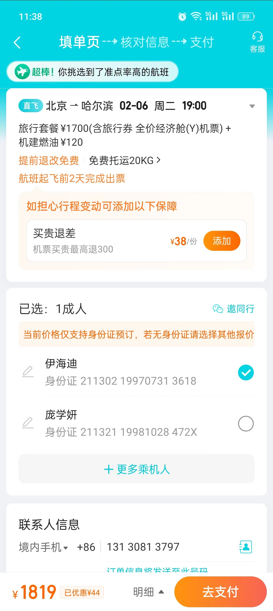
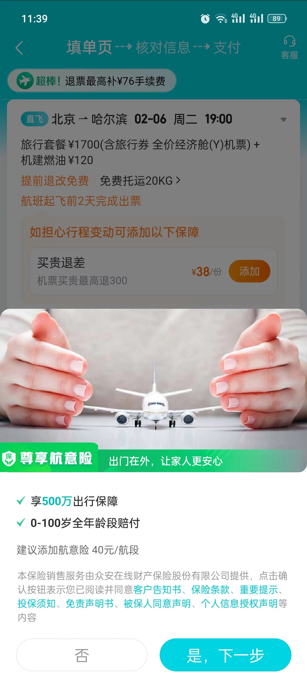

根view是OrderFillPage.js
## 组件结构
### 航班信息：FlightInfoView
```javascript
let FlightInfoView = <NewFlightInfo scrollToTop={this.scrollToTop} />;
if (flightCharterProdsType === 2) {
    // 3、4年前的代码了
    FlightInfoView = <FlightInfoProds />;
} else if (TextUtils.isNotEmpty(airRailBookingType)) {
    FlightInfoView = <AirRailView />;
}
```
包含上面轮播的提示条：`ActivityTip`组件<br /><br />航班信息组件：`FlightInfoCard`组件
### 本单可享优惠：ReduceDetailView

#### 方法所在位置
代金券、租车券啥的是通过`renderSortModules()`方法渲染出来的。<br />代金券是通过`renderSortModules()`方法中的`renderCashCouponItemView()`方法渲染出来的。<br />代金券的view：`CashCouponView`<br />代金券的model：`cashCouponModel`
#### 在本单可享优惠条目拦，想展示的各优惠条目的添加方式
通过renderReduceItems()方法过滤展示哪些条目
```javascript
// 显示所有优惠信息的函数，在此处对不需要展示的优惠信息做了过滤
renderReduceItems() {
    let { items } = this.props.store.reduceModel.reduceInfo;
    items = items.filter((item) => item.type !== xiaotuoModule);
    return items.map((item, index) => {
        return item.isReduce && !item.isCashCoupon && item.type !== xiaotuoModule && item.type !== chuanghanMileage && item?.type !== useRedeemCardItem
            ? this.renderReduceItemView(item, index)
            : null;
    });
}
```
通过pushItem()方法添加条目到priceDetailItems数组，添加时可以定义属性，在renderReduceItems()方法中根据属性过滤要展示的条目
```javascript
pageStore.pushItem('', name, '', '', realPrice, true, 0, '', false, 0, true);
```
pushItem()方法的定义。
```javascript
/**
 * 添加每一行的价格信息
 *
 * @param ageDesc         年龄描述(成人/儿童/婴儿)
 * @param priceName       名目
 * @param tradeDesc       西部航空交易费明细
 * @param priceNameDetail 说明
 * @param price           价格
 * @param isReduce        是否是立减
 * @param size            个数
 * @param countLabel      人或份
 * @param isCashCoupon   是否是代金券标识 （ 填单页3.2新加 ）
 * @param type   当前明细的具体类型 （ 填单页3.2新加 ）
 * @param activityType   如果是活动会有具体的活动类型
 * @param expCode 唯一标识，为了 带有连续购的x产品和对应连续购活动 能在价格明细里面紧挨着 特意加
 */
pushItem(ageDesc, priceName, tradeDesc, priceNameDetail, price, isReduce, size, countLabel,isGive = false, marginTop = 0, isCashCoupon = false,activityType=-1,type="activity", expCode=''){
    this.priceDetailItems.push(
        {ageDesc, priceName, tradeDesc, priceNameDetail, price, isReduce, size, countLabel, isGive, marginTop,
            priceLabel: this.makePriceLabel(price, isReduce, isGive),
            numLabel: this.makeNumLabel(size, countLabel),
            isCashCoupon,
            type,
            activityType,
            expCode
        }
    );

    this.specialHandleForContinueX(expCode);
}
```
### 生单按钮部分
OrderPrice组件中渲染booking页的`去支付按钮`，点击`去支付`后会调用`src/modules/booking/views/OrderPrice/index.js`中的`onSubmitHandler()`方法，在此方法中调用`submitOrderModel.processSubmit()`方法做生单前的娇艳，然后调用`submitOrderModel.processProductDetainLogic()`方法判断是否需要拉起保险浮层，最后调用`submitOrderModel.doSubmitOrder()`方法进行生单。<br /><br />SubmitDetainAlert组件控制底部弹层的样式，点击去支付后共有新老样式三种：ProductDetainLayer、ProductDetainAlertLayerNew和ProductDetainAlertLayerC。<br />通过submitOrderModel中的detainAlertShowState属性控制浮窗是否展示，detainAlertShowState是个get方法，就是返回detainAlertShow的值<br />点击保险浮层中的`否和是，下一步按钮`都会直接走生单逻辑：SubmitOrderCmp中的`doSubmitRequest()`方法，然后会走生单成功onSubmitSuccess()和生单失败onSubmitFail()方法。

#### 埋点和监控梳理。
生单拦截量(submit_intercept埋点) + 保险浮窗弹出量（layerShow、oldLayerShow埋点） = 去支付 按钮点击量（submitOrder埋点，定义在onSubmitHandler方法中）（任何拉起保险浮层的按钮都会走onSubmitHandler方法）<br />否 按钮 + 是，下一步 按钮（layerButtonClick埋点、oldLayerButtonClick埋点、）点击量（点击否和是，下一步按钮都会走auto_qmark_bookingpage埋点）（关闭浮窗埋点：closeSubmitDetainAlert埋点，可能会是否 按钮 + 是，下一步 按钮点击量和的2倍）**（这里逻辑有问题，不是所有场景都会弹出保险挽留弹窗的）** = 生单成功量(submitOrderSuccess埋点) + 生单失败量(submit_intercept埋点，走到printSubmitSingleInterceptionAirLog方法，occupyMsg: '生单失败处理')

layerShow埋点监控：qav_event_flight_flight_domestic_booking_detainAlert_layerShow<br />oldLayerShow埋点监控：qav_event_flight_flight_domestic_booking_detainAlert_oldLayerShow<br />submitOrder埋点监控：qav_event_flight_flight_domestic_booking_coreModuleShow_submitOrder<br />layerButtonClick埋点监控：qav_event_flight_flight_domestic_booking_detainAlert_layerButtonClick<br />oldLayerButtonClick埋点监控：mark平台上没搜到<br />auto_qmark_bookingpage埋点监控：mark平台上没搜到<br />closeSubmitDetainAlert埋点监控：qav_event_flight_flight_domestic_booking_bookingLayerStayTime_closeSubmitDetainAlert<br />submitOrderSuccess埋点监控：qav_event_flight_flight_domestic_booking_coreModuleShow_submitOrderSuccess<br />**qav_event_flight_flight_domestic_booking_coreModuleShow_submitOrderSuccess_show_f_major_bundle_rn_android_adr_Count**<br />submit_intercept埋点监控：qav_event_flight_flight_domestic_booking_submitToCashier_submit_intercept


## 各流程总结
### booking渲染流程(也可以类比其他页面的渲染流程)
#### 首先加载骨架屏。
骨架屏的作用是为了加快用户在ota页点击`预定按钮`跳转到booking页的时间，因为骨架屏中的组件比较少，所以加载很快。
#### 当呼吸页面组件挂载后，关闭骨架屏，展示呼吸页面。
按道理来说，可以没有呼吸这个步骤，因为呼吸页面和骨架屏页面的区别就在于呼吁页面的骨架是有点动画的，生动一些。<br />在`scr/components/LoadingFrame.js`文件中进行的关闭骨架屏的操作（在componentDidMount中做的，呼吸页面组件挂载完成则关闭骨架屏），同时调用`scr/components/PageLoading.js`中的`PageLoading()`方法渲染呼吸屏(所有页面的呼吸屏都是在PageLoading()方法中调用的)。
#### 当数据请求回来后，渲染完整页面。
通过`src/common/NetIndicatorModel`中的`isLoading`属性判断数据是否请求回来了：
```javascript
@computed get isLoading() {
    return this.netIndicator.type == NET_STATUS.START;
}
```
在做网络请求的store中，会通过调用`src/common/NetIndicatorModel`中的`configure`方法，改变`isLoading`等属性的值。
```javascript
@observable netIndicator = {
    loading: false, //加载框状态
    type:'', //网络请求的状态
    error:'', //失败描述
    emptyTip:'', // 为空描述
    param: undefined, //请求参数
    result: undefined, //网络请求结果
    leftLoading: false, //左半边加载
    rightLoading : false //右半边加载
};
@action.bound configure(opt) {

    this.netIndicator = {
        ...this.netIndicator,
        ...opt
    }

    //设置'重试'事件
    this.retryAction = opt.retryAction && opt.retryAction;
}
```
### 挽留弹窗`继续下单`逻辑的执行顺序

- src/modules/booking/store/rollbackModel.js：`onPressConfirm()`方法，挽留弹窗中点击继续下单按钮的点击事件。
- 如果是activityResponse节点返回的数据，执行src/modules/booking/store/CashCouponModel.js：`clearCashCoupon()`：清空老的代金券。老的代金券是指进入booking页时账户中已有的展示在`本单可享优惠栏`的代金券。
- src/modules/booking/store/index.js：`reCalcOrderPriceHandler()`方法：准备重新计算生单价格。
- src/modules/booking/store/PriceModel.js：`setData()`方法：更新数据，用于计算生单价格。
- src/modules/booking/store/PriceModel.js：`calculateOrderPrice()`方法：计算生单价格的方法。
- src/modules/booking/computations/PriceCmp.js：`calcCashCouponPrice()`方法：重新计算代金券的价格。
## 

