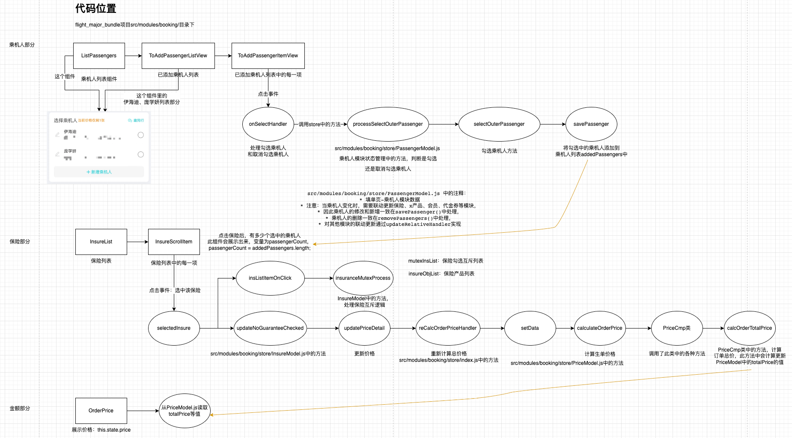

熟悉乘机人与保险模块的交互逻辑： 1.先勾选乘机人再勾选保险及先勾选保险再勾选乘机人时，乘机人与保险数据是如何绑定的 2.勾选乘机人或保险后底部的订单金额及金额明细是如何联动处理的
> src/modules/booking/store/InsureModel.js 保险模块状态管理src/modules/booking/store/PassengerModel.js 乘机人模块状态管理src/modules/booking/store/PriceModel.js 金额明细模块状态管理

> src/modules/booking/views/PassengerInfo/ 乘机人模块视图层
> src/modules/booking/views/InsureInfo/ 保险模块视图层src/modules/booking/views/InsureInfo/InsureList.js 保险模块视图层入口src/modules/booking/views/InsureInfo/InsureScrollItem.js 每一个保险商品的视图层

### 乘机人、保险、金额如何联动？
三个模块的联动是通过mobx实现的。乘机人模块在勾选中乘机人后，addedPassengers变量值会被同步改变；保险部分展示需要购买的保险份数的变量passengerCount的值是根据addedPassengers变量计算得到的；
