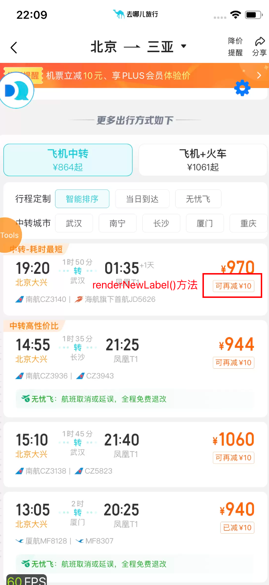
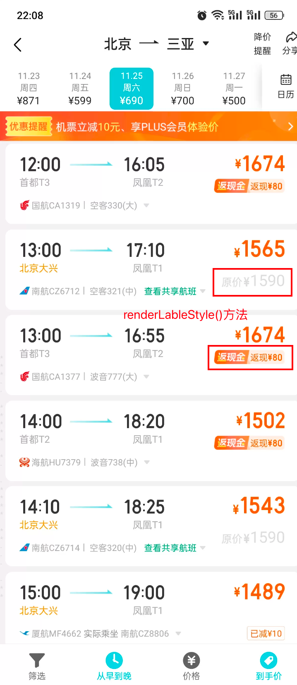
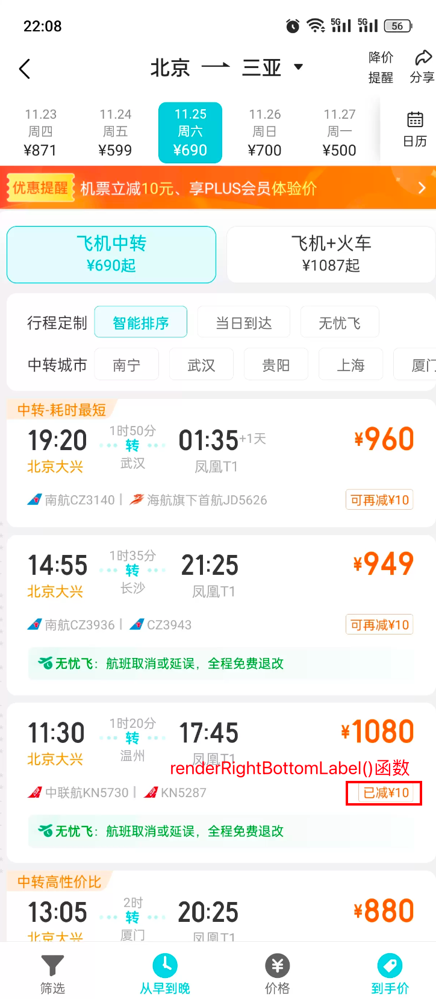
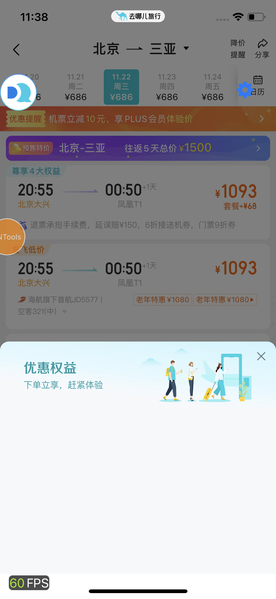

## 左下部分：航司名、飞机名
```javascript
{/*航司logo，航司名，机型，共享。点击此部分会展开飞机餐食等信息*/}
<Container
    style={styles.leftContainerStyle}
    activeOpacity={1}
    hitSlop={{ top: DeviceInfo.isNotRn ? 0 : 10, left: 10, right: 10, bottom: 10 }}
    disabled={!outsideName && flightAdditionInfoEmpty}
    onPress={() => {
        isShowLable ? null : this.setChangeOutBoardVisible(!outsideName && flightAdditionInfoEmpty);
        if (shareCarrierDesc && shareCarrierDesc.text) {
            const qavinfo = qavInfoGen2(
                'share_flight_list_item_click',
                'flight_domestic_list',
                'current_location_info',
                'click',
                {}
            );
            componentLog(qavinfo);
        }
    }}
>
    {names.map((item, index) => {
        itemTitle = item;
        if (codeShare === 1) {
            // 共享是否存在
            if (actualCarrierDesc && actualCarrierDesc.text) {
                return (
                    <View key={'namesLabelView' + index} style={styles.airContainerStyle}>
                        {airCodeLogUrl[item] ? (
                            <Image
                                style={[styles.airLogoStyle, {opacity: useDisableStyle ? 0.3 : 1}]}
                                source={{uri: airCodeLogUrl[item]}}
                            />
                        ) : null}
                        <Text
                            style={[styles.airTextStyle, disabledStyle]}
                            accessibilityLabel="flight_module_search|QunarFlightList|Code"
                            numberOfLines={1}
                        >
                            {itemTitle}
                        </Text>
                        <Text
                            style={[
                                styles.airTextStyle,
                                {color: actualCarrierDesc.color ? actualCarrierDesc.color : '#aaaaaa'}
                            ]}
                            accessibilityLabel="flight_module_search|QunarFlightList|Code"
                            numberOfLines={1}
                        >
                            {' ' + actualCarrierDesc.text + ' '}
                        </Text>
                        <Text
                            style={[styles.airTextStyle, disabledStyle]}
                            accessibilityLabel="flight_module_search|QunarFlightList|Code"
                            numberOfLines={1}
                        >
                            {mainCarrierSimpleNameAndNo}
                        </Text>

                        {index === 0 && names[1] ? (
                            <View key={'lineView' + index} style={styles.divider}/>
                        ) : null}
                    </View>
                );
            } else {
                if (codeShareList.length === 0) {
                    itemTitle = itemTitle + ' 共享' + mainCarrierSimpleNameAndNo;
                } else {
                    if (codeShareList.length > index) {
                        const shareInfo = codeShareList[index] === 1 ? ' 共享' : '';
                        itemTitle = itemTitle + shareInfo + mainCarrierSimpleNameAndNo;
                    }
                }
            }
        } else if (codeShare === 0) {
            itemTitle = itemTitle + '';
        }
        return (
            <View key={'namesLabelView' + index} style={styles.airContainerStyle}>
                {airCodeLogUrl[item] ? (
                    <Image
                        style={[styles.airLogoStyle, { opacity: useDisableStyle ? 0.3 : 1 }]}
                        source={{ uri: airCodeLogUrl[item] }}
                    />
                ) : null}
                <Text
                    style={[styles.airTextStyle, disabledStyle]}
                    accessibilityLabel="flight_module_search|QunarFlightList|Code"
                    numberOfLines={1}
                >
                    {itemTitle}
                </Text>
                {/* 航班信息间的 小竖杠，目前这个位置只有两个内容 */}
                {/* {index === 0 && names[1] ? <View key={'lineView' + index} style={styles.divider} /> : null} */}
                {/* 航班信息间的 小竖杠。数组长度大于1且当前不是最后一个元素，就加小竖杠*/}
                {names.length > 1 && index !== (names.length - 1) ? <View key={'lineView' + index} style={styles.divider} /> : null}
            </View>
        );
    })}
    {/* 航司、飞机名右边向下的小三角 */}
    {(!outsideName && flightAdditionInfoEmpty) || isShowLable ? null : (
        <View style={styles.outboardTtileStyle} accessible={false}>
            {outsideName ? <View key={'lineView'} style={styles.dividerOutViewTitle} /> : null}
            {outsideName ? (
                <Text style={styles.outViewTitleStyle} numberOfLines={1}>
                    {outsideName}
                </Text>
            ) : null}
            {/* '查看共享航班'字样 */}
            {shareCarrierDesc && shareCarrierDesc.text ? (
                <Text
                    style={[
                        styles.airTextStyle,
                        { color: shareCarrierDesc.color ? shareCarrierDesc.color : '#aaaaaa' }
                    ]}
                    accessibilityLabel="flight_module_search|QunarFlightList|Code"
                    numberOfLines={1}
                    //@ts-ignore
                    qExposeId={exposeId}
                    //@ts-ignore
                    qExposeData={JSON.stringify(qavInfo)}
                >
                    {' ' + shareCarrierDesc.text + ' '}
                </Text>
            ) : null}
            {/* 向下的小箭头Icon */}
            {flightAdditionInfoEmpty ? null : (
                <Icon
                    name={this.state.isChangeOutViewPanelShow ? 'arrowUp' : 'arrowDown'}
                    size={9}
                    color={'#ddd'}
                />
            )}
        </View>
    )}
    {this.renderChildlable(comfortableLabelContexts, isShowLable)}
</Container>
```
## 右下角价签部分
共有三个函数去渲染右下角价签：`renderNewLabel()`、`renderLableStyle()`、`renderRightBottomLabel()`函数<br />但是这块逻辑难以梳理，有很多层判断，代码如下：
```javascript
{this.props.isBigTrafficRecommend
    ? this.renderNewLabel(isRecommendFlight, baseLabels, isHaveChildOrOriginalLabel, isTimeInterval)
    : ObjectUtils.isNotEmpty(priceCutLabel)
    ? this.renderLableStyle(
          priceCutLabel,
          isRecommendFlight,
          isHaveChildOrOriginalLabel,
          isTimeInterval,
          showPriceLabelSwitch
      )
    : ArrayUtils.isNotEmpty(leftBottomLabel) || ArrayUtils.isNotEmpty(rightBottomLabel)
    ? this.renderRightBottomLabel(leftBottomLabel, rightBottomLabel, listLabel)
    : this.renderNewLabel(isRecommendFlight, baseLabels, isHaveChildOrOriginalLabel, isTimeInterval)}
```
### renderNewLabel()

### renderLableStyle()

### renderRightBottomLabel()

#### 在这里可实现并排两个价签，分别读取leftBottomLabel和rightBottomLabe属性中的值。后一个价签可额外展示一个`>`图标，且是可点击的，点击会弹出一个浮层。
控制价签样式的代码
```javascript
// 价签样式，showArrow为true时展示 向右的小三角Icon
renderLabel(label: any, showArrow: boolean) {}
```


## 点击小箭头展开航班信息、共享航班部分
航班信息和共享航班分别是两个组件，通过isChangeOutViewPanelShow属性的值控制组件的挂载和卸载，点击小箭头那一行调用setChangeOutBoardVisible()方法改变isChangeOutViewPanelShow属性的值。

航班信息和共享航班信息外层组件都设置了`**flexWrap: 'wrap'**`属性，使其内的元素自动换行。其中航班信息每个子元素指定了宽度，每行只放3个，所以看起来比较整齐。共享航班信息每个子元素则没有指定宽度。
