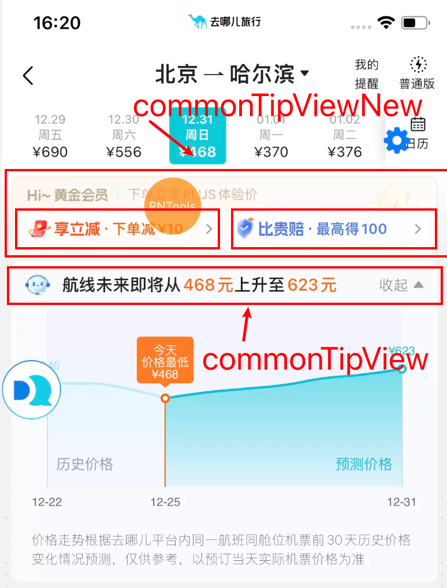
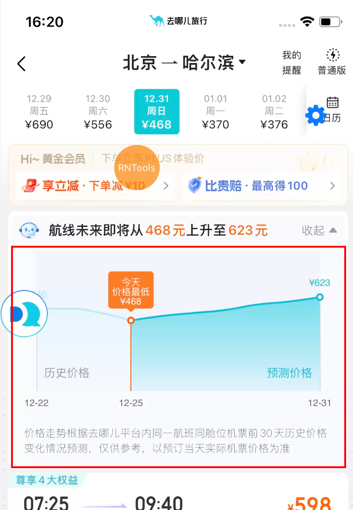

## 说明
#### 提示条位置及组件
list页的提示条目前有两个位置，一个是吸顶的，一个是跟随list页滚动的，这两个位置的提示条其实用的是同一个组件CommonTipView，如果需要吸顶的话就写在singleSearchPage组件里，如果不需要吸顶的话就写在listContent组件里。 listContent组件渲染的就是list页的机票列表。
#### 提示条组件整合
后来岩哥把提示条整合了一下，有了commonTipViewNew提示条组件，这个组件就是像图片中一样，可以放会员、享立减、比贵赔三个提示内容，非常高级。commonTipView组件就基本不用了，只有低价预测在用。
#### listContent组件结构
listContent组件是list页的机票列表组件，是滚动的，这个组件又分成了三个大部分，由三个函数渲染：renderHeader()、renderRow()、renderFooter()。 其中renderHeader()渲染的部分就包含不吸顶的提示条：FixedView组件、renderRow()渲染机票列表、renderFooter()渲染底部文案。 
### 低价预测提示条
使用的是commonTipView组件，取的节点是unifiedTip下的richActivityTip。 src/components/commonTipView/index.tsx中的renderWebviewPanel()方法，渲染展开后的低价预测曲线。 
#### 互斥展示逻辑
目前看不吸顶的提示条位置只会展示两个内容：儿童畅游卡的推荐和低价预测条。在fixedView中通过showActivityTipView属性做互斥。
#### 位置改变
原本低价预测提示条展示在不吸顶的提示条位置，后来产品提需求，我给改到了list页最低报价下方。
