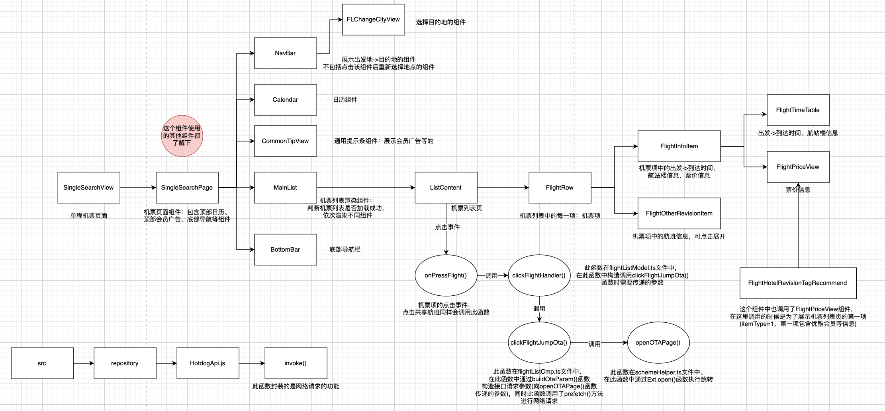

### 组件层级关系

### QComponent
```javascript
class SingleSearchPage extends QComponent {
    constructor(props) {
        super(props);
        // 关闭骨架屏
        this.closeSkeleton = () => {
            //@ts-ignore
            this._qrnCloseSkeleton && this._qrnCloseSkeleton();
        };
        this.state = {
            waterText: ''
        };
        this.getMossadSwitch();
    }
    // 渲染骨架屏
    renderSkeleton() {
        const { param } = this.props;
        return <SingleSkeletonView param={param} />;
    }
```
QComponent是公司自己实现的，里面会包含渲染骨架屏的函数renderSkeleton()和关闭骨架屏的函数_qrnCloseSkeleton()，也就是说，如果想要使用公司定义的骨架屏组件，就需要继承QComponent。
### 骨架屏优化
> 宇哥给的参考资料：
> Qunar骨架屏的使用方式：[https://wiki.corp.qunar.com/confluence/pages/viewpage.action?pageId=526445211](https://wiki.corp.qunar.com/confluence/pages/viewpage.action?pageId=526445211)
> 技术方案：[https://wiki.corp.qunar.com/confluence/pages/viewpage.action?pageId=516812676](https://wiki.corp.qunar.com/confluence/pages/viewpage.action?pageId=516812676)
> 历史骨架屏&拆包技术方案：[https://wiki.corp.qunar.com/confluence/pages/viewpage.action?pageId=526445205](https://wiki.corp.qunar.com/confluence/pages/viewpage.action?pageId=526445205)
> 点击跳转卡顿优化方案概述：[https://wiki.corp.qunar.com/confluence/pages/viewpage.action?pageId=455257646](https://wiki.corp.qunar.com/confluence/pages/viewpage.action?pageId=455257646)

在点击搜索进入机票详情页时，首先会执行组件代码中的import语句，然后才能执行到代码中的骨架屏组件，而import语句是很费时的，所以需要考虑怎样加快页面的渲染速度。（具体表现为，点击搜索时，会延迟大概0.5秒左右才会进入机票详情页，在Android上延迟比IOS上要明显很多）<br />有两种方式解决方式，一种是使用懒加载，将import语句改为require语句，这样模块会在使用的时候才被加载；另一种方式是在进入页面时先不加载写有很多import的那个页面，而是加载一个空白页，空白页中包含骨架屏组件（所以点击搜索后会很快进入机票详情页展示骨架屏），此时异步加载原页面，，会加快用户进入页面的时间。(将除首屏加载需要的模块全部拆分出去, 这样首次打开只需要加载必要的模块, 从而增加首次打开的速度)
### 拆包
JSBundle 的拆包，是为了尽快进入渲染阶段。<br />骨架屏方案，是为了提升首屏加载速度，加速了页面点击响应速度。
```javascript
var __decorate =
    (this && this.__decorate) ||
    function (decorators, target, key, desc) {
        var c = arguments.length,
            r = c < 3 ? target : desc === null ? (desc = Object.getOwnPropertyDescriptor(target, key)) : desc,
            d;
        if (typeof Reflect === 'object' && typeof Reflect.decorate === 'function')
            r = Reflect.decorate(decorators, target, key, desc);
        else
            for (var i = decorators.length - 1; i >= 0; i--)
                if ((d = decorators[i])) r = (c < 3 ? d(r) : c > 3 ? d(target, key, r) : d(target, key)) || r;
        return c > 3 && r && Object.defineProperty(target, key, r), r;
    };
```
### react-native-ext -> lib -> core.js里定义了渲染骨架屏和关闭骨架屏的函数
关闭骨架屏函数，在函数内部设置_qrn_render_skeleton变量的state。
```javascript
this._qrnCloseSkeleton = () => {
    this.setState({
        _qrn_render_skeleton: true
    });
};
```

### 接口
在控制台可以看到主要接口的输出信息：<br />"预搜成功" 字样后的数据：是机票列表页的数据。-> 此对象中有一个flightGroups数组，数组中的每一项包含若干航班信息，每一条就是机票列表页的一个机票项。 -> 机票项中有一个`extparams`参数，是点击机票项到ota页时，传递过去的参数。
