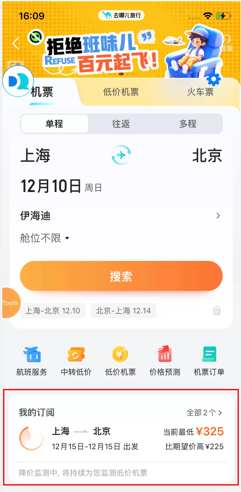

### 组件调用关系
src/views/FlightHome/NewFeedFlow/SubscribeRemind/index.js：`renderMainView()`方法：渲染我的订阅卡片。
### 展示逻辑
```javascript
render() {
    // isFinsh应该是写错了，应该是想写isFinish，该变量用于标明接口请求是否完毕。
    let { payload,isFinsh = false} = this.props.subscribeRemind;
    if (this.nativeSubscribeRemind && (!payload || JSON.stringify(payload) === '{}') && !isFinsh) {
        return this.renderMainView(this.nativeSubscribeRemind);
    } else {
        if (!payload || JSON.stringify(payload) === '{}') return null;
        return this.renderMainView(payload);
    }
}
```

1. 进入home页时，首先查看本地是否有缓存的订阅信息，有则展示。（此时展示的我的订阅卡片是没有价格的，因为数据还没有请求回来）
2. 调用接口请求数据，若数据成功返回，则刷新我的订阅卡片，展示上价格等信息。同时将此次请求的数据缓存到本地。
3. 调用接口请求数据，若返回的数据为空或者请求接口异常，则清空本地缓存的数据（用一个空对象覆盖本地的数据），同时不再展示我的订阅卡片。
