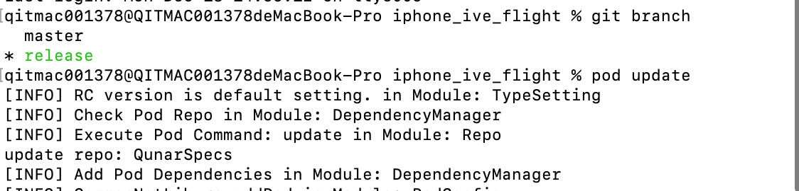
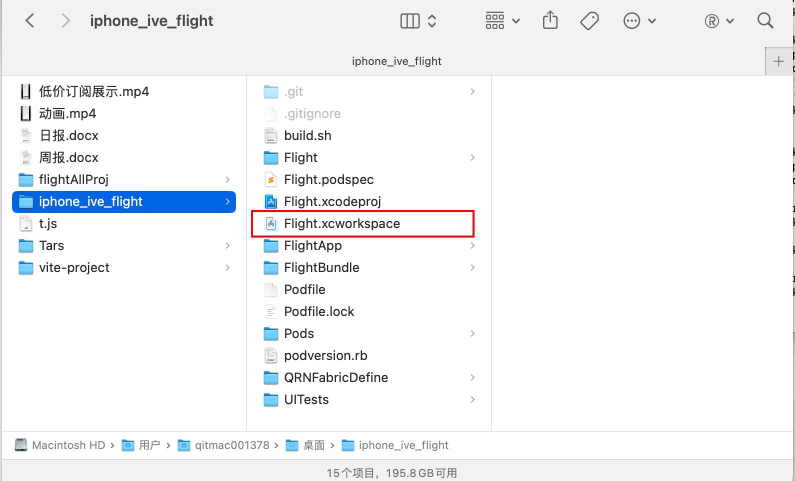
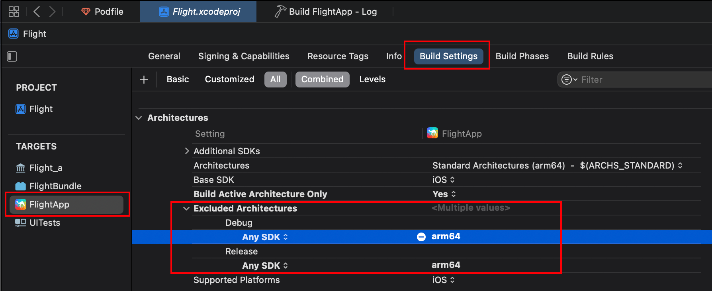
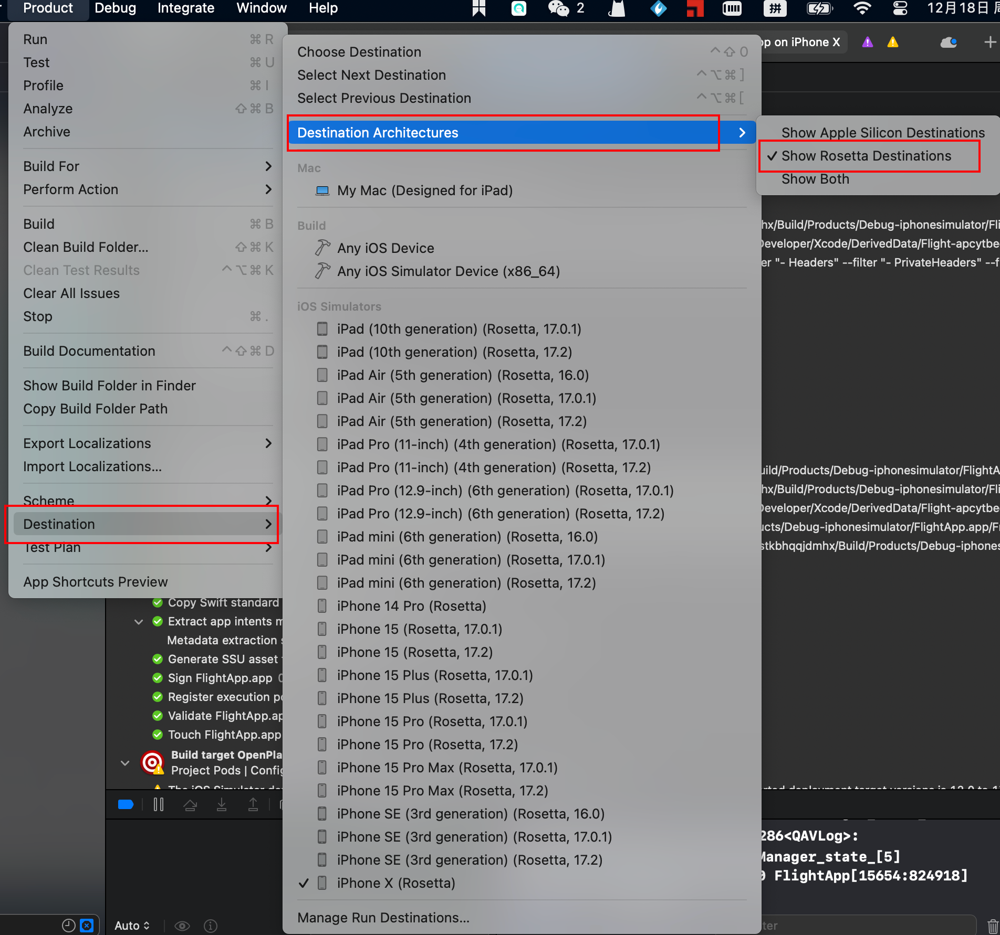
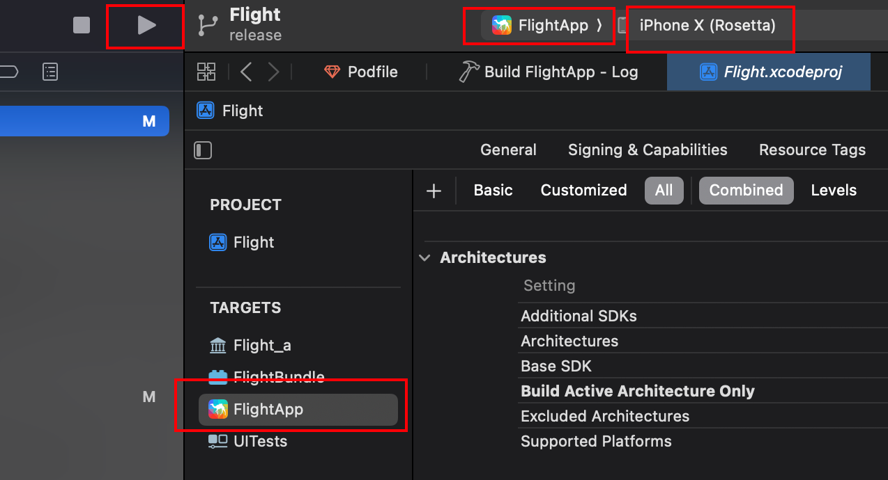
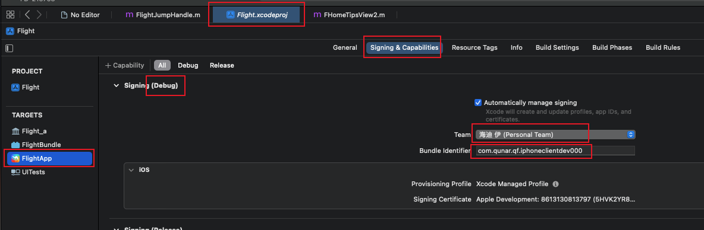
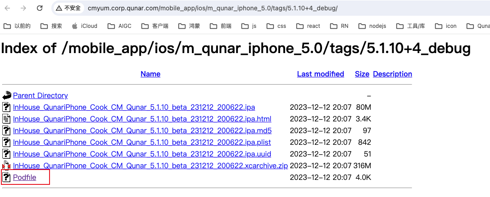
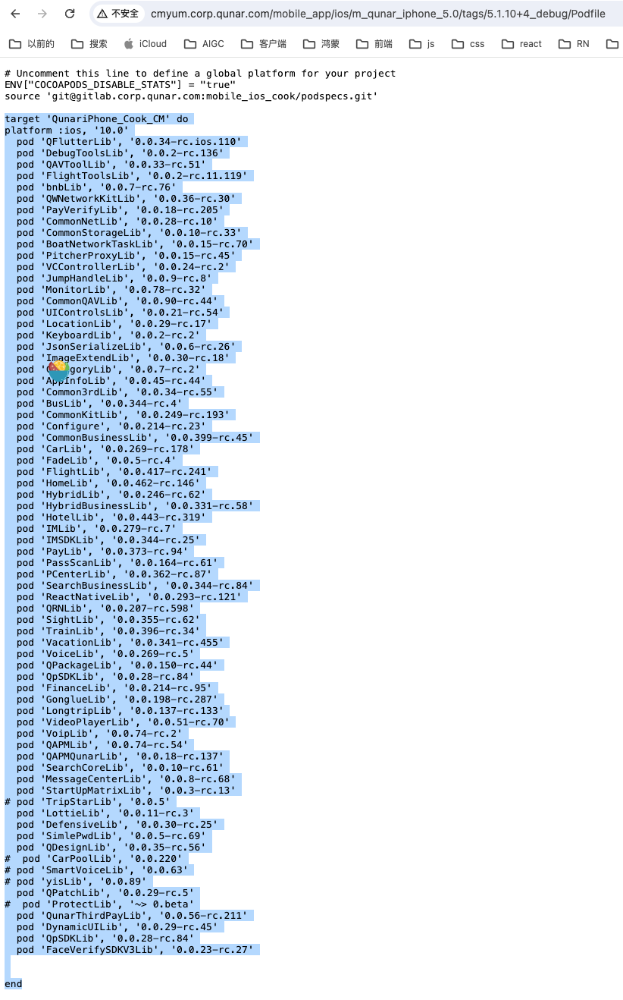
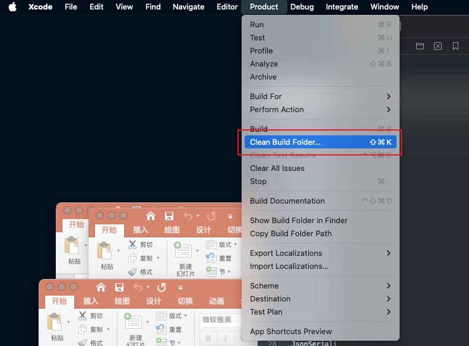

# 启动、环境相关
### 启动工程步骤
#### clone项目代码
> 代码地址：git@gitlab.corp.qunar.com:mobile_ios_cook/iphone_ive_flight.git

clone下来代码后，切到release分支（因为最新的代码是在release分支的），然后从release分支创建需求分支。
#### 在项目根目录下打开终端，执行pod update

#### 在工程文件夹中双击图中文件打开工程。如果直接从XCode打开的话，是不包含刚才下载的依赖的。


#### 启动项目
> 报错问题解决：
> [https://jianshu.com/p/651e8cbcdf50](https://jianshu.com/p/651e8cbcdf50)
> [https://www.jianshu.com/p/32917b7dbcc8](https://www.jianshu.com/p/32917b7dbcc8)

##### 问题1。（这个问题不是必须解的，把问题2解了之后，问题1也就解了）
Building for 'iOS-simulator', but linking in object file (/Users/qitmac001378/Desktop/iphone_ive_flight/Pods/AppInfoLib/library/libAppInfo_a.a[arm64][2](QNRReportUidInfo.o)) built for 'iOS'<br />解决：[https://jianshu.com/p/651e8cbcdf50](https://jianshu.com/p/651e8cbcdf50)<br />
##### 问题2。这块一定要先把模拟器设置成Rosetta，再看是否还会有问题
解决：[https://www.jianshu.com/p/32917b7dbcc8](https://www.jianshu.com/p/32917b7dbcc8)<br />按照下图方式进行设置，模拟器就是Rosetta模式，当然也可以选择Show Both，就是Rosetta和非RosettaRosetta都显示出来了。<br />

##### 启动项目
选择FlightApp，iPhoneX Rosetta模式机型。<br />

##### 启动项目后程序有崩溃情况。（原因是代码中有的地方没有判空）
在模拟器中把app删了，然后重新运行项目，应该可以解决此问题。

### 连接真机调试
在XCode中登录上个人开发者账号，在Bundle Identifier中会自动带入去哪网的信息，后面随便填几个数字即可。<br /><br />在XCode启动项目后，手机上可能会出现提示：`您的设备管理设置不允许在此台iPhone上` 提示。<br />在手机中设置-》通用-》设备管理-》对应的账号-》信任。即可解决此问题。<br />由于pod中的一些包可能没有依赖全，所以需要去md平台看下缺的库名，补充到podfile中
#### md平台看依赖版本，可以在debug包的podfile中点进去看到
<br />
#### 调试过程中如启动失败，可以尝试清空缓存，操作如下图：


### 能真机调试的padfile文件
```javascript
# 引入脚本文件
$LOAD_PATH.unshift(File.dirname(__FILE__))
require 'podversion.rb'
#TypeSetting.prodType
TypeSetting.rcType

#####################################################################################

# Uncomment this line to define a global platform for your project
platform :ios, '10.0'

# 如果要看 CommonFramework 的源代码联调，解开下面CommonFramework的注释，pod update 即可。

# 如果要看其他业务线的代码，请告知TL，TL有权限。

#####################################################################################

ENV["COCOAPODS_DISABLE_STATS"] = "true"

source 'git@gitlab.corp.qunar.com:mobile_ios_cook/podspecs.git'
#source 'https://mirrors.tuna.tsinghua.edu.cn/git/CocoaPods/Specs.git'


#####################################################################################

# 检查Qunar Spec仓库
DependencyManager.checkPodRepo

# 配置依赖类型
#DependencyManager.config('ReactNativeLib', 'version', '0.0.282-beta.PT-107208-deeplink.956')
#
#

# 本地联调
# DependencyManager.config('ReactNativeLib', 'version', '0.0.284-rc.16')
#DependencyManager.config('QRNLib', 'version', '0.0.191-rc.217')
# DependencyManager.config('QDesign', 'path', '../qdesign-ios')

#DependencyManager.config('QDesignLib', 'version', '0.0.33-beta.FD-191814.34')
#DependencyManager.config('Lottie', 'path', '/Users/qitmac001292/Desktop/project/lottie_lib')

#DependencyManager.config('QRNLib', 'version', '0.0.180-beta.PT-107208-deeplink.1681')
#DependencyManager.config('AppInfoLib', 'version', '0.0.25-beta.PT-77802.92')
#DependencyManager.config('Configure', 'version', '0.0.182-beta.PT-77802.536')

#DependencyManager.config('CommonKitLib', 'version', '0.0.225-beta.PT-107209-deeplink-jump.1300')
#DependencyManager.config('LocationLib', 'version', '0.0.23-beta.FD-131910-view.166')

#DependencyManager.config('QAVToolLib', 'version', '0.0.32-rc.30')

#DependencyManager.config('QFlutterLib', 'version', '0.0.19-rc.ios.1126.simulator')
#DependencyManager.config('QFlutterLib', 'version', '0.0.30-beta.ios-enable-fabric-switch.1326')


#DependencyManager.config('FlightToolsLib', 'version', '0.0.2-beta.FD-53871.172')
#DependencyManager.config('HotelLib', 'version', '0.0.419-beta.FD-148305.3245')

#DependencyManager.config('ReactNativeLib', 'version', '0.0.280-beta.v0.68.1.940')

#DependencyManager.config('CommonKitLib', 'version', '0.0.224-beta.v0.68.1.1290')

#DependencyManager.config('PCenterLib', 'version', '0.0.345-rc.1553')

#DependencyManager.config('CommonKitLib')
#DependencyManager.config('FinanceLib')
#DependencyManager.config('QunarThirdPayLib', 'version', '0.0.47-beta.qunar-loading-merge.60')
#DependencyManager.config('PayLib', 'version', '0.0.366-beta.PAY-2633553-hotel-loading.3')

# Flight_a(机票的静态库文件)
#target 'Flight_a' do     #------ Flight_a 请不要复制粘贴 ------#
#  
#    # 添加依赖名称
#    DependencyManager.addPod(
#                             'CommonNetLib',#强依赖
#                             'CommonStorageLib',#强依赖
#                             'BoatNetworkTaskLib',#强依赖
#                             'PitcherProxyLib',#强依赖
#                             'VCControllerLib',#强依赖
#                             'JumpHandleLib',#强依赖
#                             #'MonitorLib',#强依赖
#                             'CommonQAVLib',#强依赖
#                             'UIControlsLib',#强依赖
#                             'LocationLib',#强依赖
#                             'KeyboardLib',#强依赖
#                             'JsonSerializeLib',#强依赖
#                             'ImageExtendLib',#强依赖
#                             'CategoryLib',#强依赖
#                             'AppInfoLib',#强依赖
#                             'Common3rdLib',#强依赖
#                             'CommonKitLib',#强依赖
#                             'HomeLib',#强依赖
#                             'ReactNativeLib',#强依赖
#                             'PCenterLib',#强依赖
#                             'FadeLib',#强依赖
#                             'Configure',#强依赖
#                             'HybridLib',#强依赖
##                             'HotelLib',
#                             'SearchCoreLib',
#                             'QPackageLib',
#                             'QRNLib',
#                             'VideoPlayerLib',
#                             'IMLib',
#                             'IMSDKLib',
#                             'DebugToolsLib',
#                             'yisLib',
#                             'LottieLib',
#                             'DefensiveLib'
#                             )
#                             # 应用添加的依赖
#                             podDependenciesApply
#end


#####################################################################################


# FlightApp(app外壳_本地调试用)
target 'FlightApp' do   #------ FlightApp 请不要复制粘贴  ------#
#    pod 'FlightTools',:path => '/Users/yucui/Documents/Qunar/ios/iphone_flight_tools'
    #pod 'Monitor',:path => '/Users/test/Documents/wayne_work/cocospod/sublib/iphone_monitor/'
    
#    pod 'LookinServer', :configurations => ['Debug']
#    DependencyManager.addPod(
#
#                             )
                             
                             podDependenciesApply
end

target 'Flight_a' do
platform :ios, '10.0'
  pod 'QFlutterLib', '0.0.34-rc.ios.110'
  pod 'DebugToolsLib', '0.0.2-rc.136'
  pod 'QAVToolLib', '0.0.33-rc.51'
  pod 'FlightToolsLib', '0.0.2-rc.11.119'
  pod 'bnbLib', '0.0.7-rc.76'
  pod 'QWNetworkKitLib', '0.0.36-rc.30'
  pod 'PayVerifyLib', '0.0.18-rc.205'
  pod 'CommonNetLib', '0.0.28-rc.10'
  pod 'CommonStorageLib', '0.0.10-rc.33'
  pod 'BoatNetworkTaskLib', '0.0.15-rc.70'
  pod 'PitcherProxyLib', '0.0.15-rc.45'
  pod 'VCControllerLib', '0.0.24-rc.2'
  pod 'JumpHandleLib', '0.0.9-rc.8'
  pod 'MonitorLib', '0.0.78-rc.32'
  pod 'CommonQAVLib', '0.0.90-rc.44'
  pod 'UIControlsLib', '0.0.21-rc.54'
  pod 'LocationLib', '0.0.29-rc.17'
  pod 'KeyboardLib', '0.0.2-rc.2'
  pod 'JsonSerializeLib', '0.0.6-rc.26'
  pod 'ImageExtendLib', '0.0.30-rc.18'
  pod 'CategoryLib', '0.0.7-rc.2'
  pod 'AppInfoLib', '0.0.45-rc.44'
  pod 'Common3rdLib', '0.0.34-rc.55'
  pod 'BusLib', '0.0.344-rc.4'
  pod 'CommonKitLib', '0.0.249-rc.193'
  pod 'Configure', '0.0.214-rc.23'
  pod 'CommonBusinessLib', '0.0.399-rc.45'
  pod 'CarLib', '0.0.269-rc.178'
  pod 'FadeLib', '0.0.5-rc.4'
#  pod 'FlightLib', '0.0.417-rc.241'
  pod 'HomeLib', '0.0.462-rc.146'
  pod 'HybridLib', '0.0.246-rc.62'
  pod 'HybridBusinessLib', '0.0.331-rc.58'
  pod 'HotelLib', '0.0.443-rc.319'
  pod 'IMLib', '0.0.279-rc.7'
  pod 'IMSDKLib', '0.0.344-rc.25'
  pod 'PayLib', '0.0.373-rc.94'
  pod 'PassScanLib', '0.0.164-rc.61'
  pod 'PCenterLib', '0.0.362-rc.87'
  pod 'SearchBusinessLib', '0.0.344-rc.84'
  pod 'ReactNativeLib', '0.0.293-rc.121'
  pod 'QRNLib', '0.0.207-rc.598'
  pod 'SightLib', '0.0.355-rc.62'
  pod 'TrainLib', '0.0.396-rc.34'
  pod 'VacationLib', '0.0.341-rc.455'
  pod 'VoiceLib', '0.0.269-rc.5'
  pod 'QPackageLib', '0.0.150-rc.44'
  pod 'QpSDKLib', '0.0.28-rc.84'
  pod 'FinanceLib', '0.0.214-rc.95'
  pod 'GonglueLib', '0.0.198-rc.287'
  pod 'LongtripLib', '0.0.137-rc.133'
  pod 'VideoPlayerLib', '0.0.51-rc.70'
#  pod 'VoipLib', '0.0.74-rc.2'
  pod 'QAPMLib', '0.0.74-rc.54'
  pod 'QAPMQunarLib', '0.0.18-rc.137'
  pod 'SearchCoreLib', '0.0.10-rc.61'
  pod 'MessageCenterLib', '0.0.8-rc.68'
  pod 'StartUpMatrixLib', '0.0.3-rc.13'
 pod 'TripStarLib', '0.0.5'
  pod 'LottieLib', '0.0.11-rc.3'
  pod 'DefensiveLib', '0.0.30-rc.25'
  pod 'SimlePwdLib', '0.0.5-rc.69'
  pod 'QDesignLib', '0.0.35-rc.56'
#  pod 'CarPoolLib', '0.0.220'
# pod 'SmartVoiceLib', '0.0.63'
 pod 'yisLib', '0.0.89'
  pod 'QPatchLib', '0.0.29-rc.5'
#  pod 'ProtectLib', '~> 0.beta'
  pod 'QunarThirdPayLib', '0.0.56-rc.211'
  pod 'DynamicUILib', '0.0.29-rc.45'
  pod 'QpSDKLib', '0.0.28-rc.84'
  pod 'FaceVerifySDKV3Lib', '0.0.23-rc.27'


end
#####################################################################################


#post_install do |installer|
#installer.pods_project.targets.each do |target|
#  target.build_configurations.each do |config|
#    config.build_settings['GCC_PREPROCESSOR_DEFINITIONS'] = ['COCOAPODS=1', 'YRN_OPT=1', 'BETA_BUILD=1', 'RCT_DEV=1', 'RCT_DEBUG=1']
#  end
#end

post_install do |installer|
    installer.pods_project.targets.each do |target|
        target.build_configurations.each do |config|
            xcconfig_path = config.base_configuration_reference.real_path
            xcconfig = File.read(xcconfig_path)
            #            自动适配 CommonFrameworkLib CommonFramework
            if xcconfig.include? ' -l"CommonFramework"'
                if xcconfig.include? ' -l"CommonFramework_a"'
                    puts "Remove #{target.name} CommonFrameworkLib from link flag"
                    c1 = xcconfig.sub(' -l"CommonFramework_a"', '')
                    File.open(xcconfig_path, "w") { |file| file << c1 }
                end
            end

            #            添加 BETA_BUILD 预编译宏
            if xcconfig.include? 'GCC_PREPROCESSOR_DEFINITIONS = $(inherited)'
                puts "Append #{target.name} Precompile Define BETA_BUILD=1"
                c1 = xcconfig.sub('GCC_PREPROCESSOR_DEFINITIONS = $(inherited)', 'GCC_PREPROCESSOR_DEFINITIONS = $(inherited) BETA_BUILD=1')
                File.open(xcconfig_path, "w") { |file| file << c1 }
                else
                puts "Add #{target.name} Precompile Define BETA_BUILD=1"
                s1 = 'GCC_PREPROCESSOR_DEFINITIONS = BETA_BUILD=1'
                File.open(xcconfig_path, "a+") { |file| file.write("\n#{s1}") }
            end

            #            添加 YRN_OPT 预编译宏
#            if xcconfig.include? 'GCC_PREPROCESSOR_DEFINITIONS = $(inherited)'
#                puts "Append #{target.name} Precompile Define YRN_OPT=1"
#                c1 = xcconfig.sub('GCC_PREPROCESSOR_DEFINITIONS = $(inherited)', 'GCC_PREPROCESSOR_DEFINITIONS = $(inherited) YRN_OPT=1')
#                File.open(xcconfig_path, "w") { |file| file << c1 }
#                else
#                puts "Add #{target.name} Precompile Define YRN_OPT=1"
#                s1 = 'GCC_PREPROCESSOR_DEFINITIONS = YRN_OPT=1'
#                File.open(xcconfig_path, "a+") { |file| file.write("\n#{s1}") }
#            end


        end
    end
end


#####################################################################################

```
