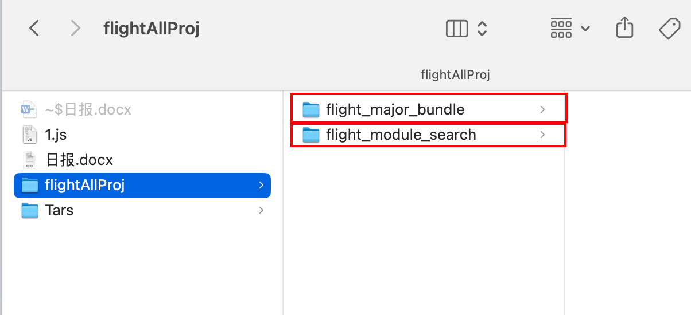
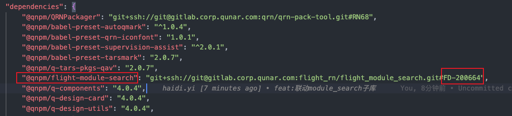

## flight_major_bundle主库联调flight_module_search子库
### 方法一：修改metro.config.js文件，解开module.exports中的部分代码。（提交flight_major_bundle库的代码时，要再注释上）（打包major_bundle时，需要先发布module_search子库，把子库版本号写到major_bundle的package.json中再打包major_bundle）
原本module.exports里的代码都注释着呢，解开后如下：
```javascript
module.exports = {
    // 这个属性不要放开，跟公共的es6优化冲突，会导致项目红屏
    // transformer: {
    //     getTransformOptions: async () => ({
    //         transform: {
    //             experimentalImportSupport: false,
    //             inlineRequires: false
    //         }
    //     })
    // },
    resolver: {
        extraNodeModules: new Proxy(
            {},
            {
                get: (target, name) => {
                    return path.join(__dirname, `node_modules/${name}`);
                }
            }
        )
    },
    watchFolders: getWatchFolders()
};
```
### 确保flight_major_bundle和flight_module_search库在同一文件夹下


### 方法二：修改flight_major_bundle库的package.json文件（打包时，直接打major_bundle包就行，会自动找到module_search对应pmo的代码）
找到"@qnpm/flight-module-search"库，将其版本号修改为PMO号（FD-200664）对应的flight-module-search库的gitlab分支链接。<br />**git+ssh://git@gitlab.corp.qunar.com:flight_rn/flight_module_search.git#FD-200664 （这个链接不是直接复制来的，是要自己拼接PMO号搞出来的）**<br />
### 在flight_major_bundle根目录下执行`qrn install`后执行`qrn run`启动项目
此时在flight_module_search库中编写代码保存后在手机debug包中应该可以看到修改后的内容了

## flight_major_bundle主库联调q-design子库
### 修改metro.config.js文件，解开module.exports中的部分代码。（提交flight_major_bundle库的代码时，要再注释上）
#### 在watchQdFolders中把要调试的q-design库中的子包名字加入。
#### 在getWatchFolders()函数中把q-design库的注释解开
解开这行代码的注释：`folders.push(...watchQdFolders.map(packageName => getModuleQdPath(packageName)));`
#### 确保getModuleQdPath()函数中q-design库的路径正确
#### package.json文件总体如下：
```json
const path = require('path');

const watchFolders = [
  // 'qunar-business-utils',
  // 'qunar-business-serviceLayer',
  // 'qunar-business-intercept',
  // 'qunar-business-flightHotel',
  // 'qunar-business-merge-pay-reminder'
  // 'qunar-business-choose-buy-layer'
];

//需要link的子库名称
const watchFoldersPkgs = [
  // 'q-pkgs-change-city-panel',
  // 'q-pkgs-cool-modal-float',
  // 'q-pkgs-html-view',
  // 'q-pkgs-performance',
  // 'q-pkgs-pull-refresh-listView',
  // 'q-pkgs-q-flatList',
  // 'q-pkgs-qunar-image',
  // 'q-pkgs-scroll-tab-view',
  // 'q-pkgs-slugger',
  // 'q-pkgs-custom-alert',
  // 'q-pkgs-html-view',
  // 'q-pkgs-din-text',
  // 'q-pkgs-native-cool-modal-float',
  // 'q-pkgs-utils',
  // 'q-pkgs-r-modal',
  // 'q-pkgs-mobx-infrastructure',
  // 'q-pkgs-patch-qrn',
  // 'q-pkgs-pinvoke-assembly',
  // 'q-pkgs-rn-request',
  // 'q-pkgs-statistics'
];

const watchQdFolders = [
  'q-gesture-float'
  // 'q-design-card',
  // 'q-shadow'
];

/**
* 获取本地库目录
* @param name
* @returns {string}
*/
function getComponentPath(name) {
  return path.resolve(__dirname, `../qunar-mobility-business/packages/${name}/`);
}

//需要link的子库目录
function getComponentPathPkgs(name) {
  return path.resolve(__dirname, `../qunar-mobility-pkgs/packages/${name}/`);
}

//module search的目录
function getModuleSearchPath() {
  return path.resolve(__dirname, `../flight_module_search/`);
}

function getModuleQdPath(name) {
  return path.resolve(__dirname, `../q-design/packages/${name}/`);
}

function getWatchFolders() {
  let folders = [];
  // folders.push(...watchFolders.map(packageName => getComponentPath(packageName)));
  // folders.push(...watchFoldersPkgs.map(packageName => getComponentPathPkgs(packageName)));
  folders.push(...watchQdFolders.map(packageName => getModuleQdPath(packageName)));
  // folders.push(getModuleSearchPath());
  return folders;
}

module.exports = {
  // 这个属性不要放开，跟公共的es6优化冲突，会导致项目红屏
  // transformer: {
  //     getTransformOptions: async () => ({
  //         transform: {
  //             experimentalImportSupport: false,
  //             inlineRequires: false
  //         }
//     })
// },
resolver: {
  extraNodeModules: new Proxy(
  {},
{
  get: (target, name) => {
  return path.join(__dirname, `node_modules/${name}`);
}
}
)
},
watchFolders: getWatchFolders()
};

```
### 修改q-design库里面的子包q-gesture-float(举例，调试哪个子包就去哪个子包下改)中的package.json文件
把`main`字段改了，调试时：`"src/index.ts"`，线上时：`"dist/index.js"`。这样改的原因是线上找的是编译后的js文件，而我们调试时想改的是编译前的ts代码。如果不这样改的话，需要在每次修改代码后，在`q-design`库的根目录执行：`npm run build`编译代码，不然主库与子库联调会失败。
```
{
    "name": "@qnpm/q-gesture-float",
    "version": "4.0.7",
    "description": "",
    "main": "src/index.ts",			# 调试时："src/index.ts"，线上时："dist/index.js",
    "scripts": {
        "test": "echo \"Error: no test specified\" && exit 1"
    },
    "files": [
        "dist",
        "src"
    ],
    "author": "",
    "license": "ISC",
    "dependencies": {
        "@qnpm/q-design-utils": "^4.0.7",
        "@qnpm/q-popup-layer": "^4.0.7",
        "@qnpm/q-theme": "^4.0.7",
        "@qnpm/qportal": "^0.0.1",
        "@qnpm/qrn-hooks": "^1.0.7",
        "tslib": "^2.0.1"
    }
}
```

### 注：如果前面都执行好了后子库与主库没有联动起来，可以在主库执行命令清下缓存
在`flight_major_bundle`库根目录下执行：
```javascript
rm -rf ~/.rncache
rm -rf qrn.lock
sudo rm $TMPDIR/*
sudo rm -rf $TMPDIR/*
watchman watch-del-all
rm -rf node_modules/
qrn install
```


